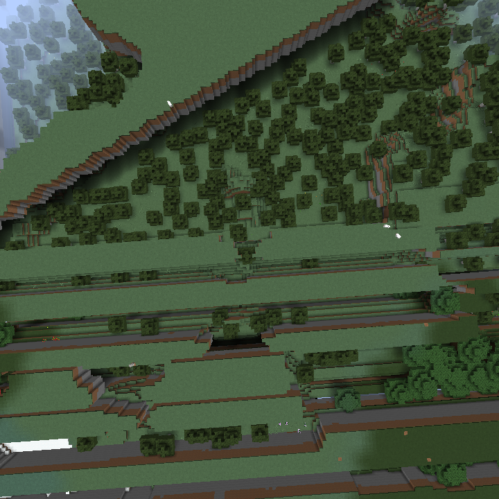

# FarLands [![][release-badge]][releases-link] [![][cf-downloads-badge]][cf-link] [![][cf-available-badge]][cf-link]
*Brings back the Far Lands and removes the world border.*
## Licensing
All commits before [ecd7691][switch-to-mit-commit] are licensed under CC0.  
All commits, including and after [ecd7691][switch-to-mit-commit] are licensed under [MIT](LICENSE). 

FarLands, as of [f6bc3ac][bundle-fiber-commit], bundles [Fiber][fiber], which is licensed under [Apache v2](LICENSE-FIBER).

[fiber]: https://github.com/DaemonicLabs/fiber
[release-badge]: https://img.shields.io/github/v/release/polgaria/FarLands?include_prereleases
[cf-downloads-badge]: http://cf.way2muchnoise.eu/farlands.svg
[cf-available-badge]: http://cf.way2muchnoise.eu/versions/farlands.svg
[switch-to-mit-commit]: https://github.com/polgaria/FarLands/commit/ecd76914d7198fece89e776771da25dd476b034d
[bundle-fiber-commit]: https://github.com/polgaria/FarLands/commit/f6bc3acc35f7e7bf8e1ad502657f0539af480e5c
[cf-link]: https://minecraft.curseforge.com/projects/farlands
[releases-link]: https://github.com/polgaria/FarLands/releases